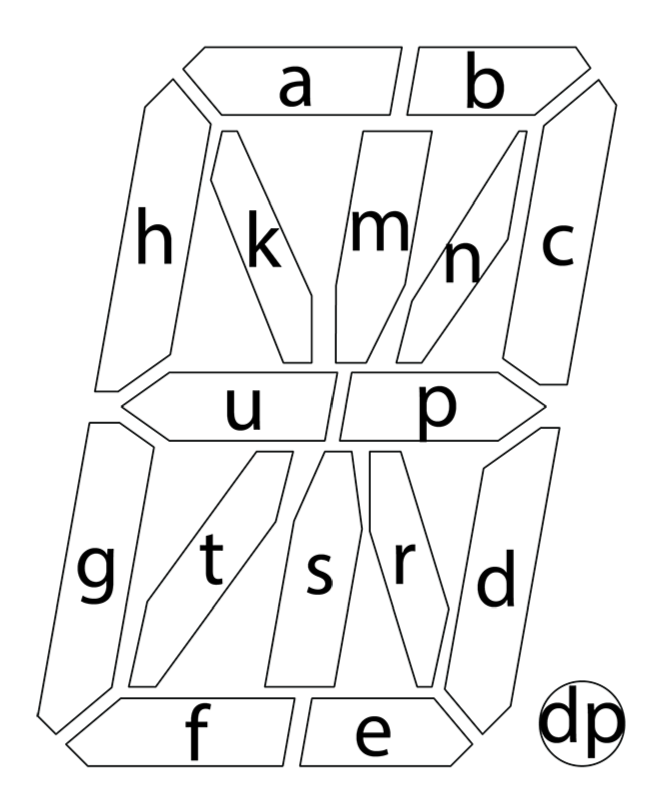

# 𡇒

> Dear challenger,
> 
> Remember, 88BB80F394C088CF2233A212000F0030A0A1C060A2A1A848C060A04080E000302000A0A10030A040C0604040C06080400030C060A0402060AA022A21.
> 
> Yours,
> 𡇒 from the Land of Utsrpn Mkhgfedcba

## Writeup

The title and “utsrpnmkhgfedcba” suggest that this is a 16 segment display payload, where “utsrpnmkhgfedcba” is the bits order. Recover the display content and read from the screen to get the flag.

