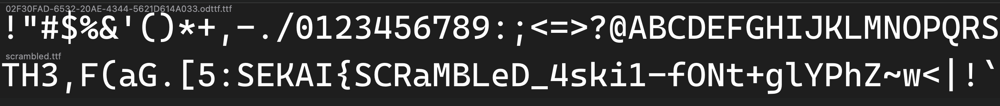
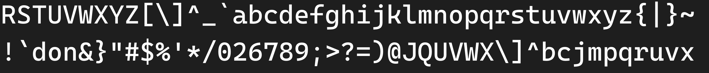

# Broken converter

{Insert name here} finally finished his assignment and ready to submit it, but for some reasons the school requires all assignments to be submitted as XPS files. {Insert name here} found a converter online and used the converted file for submission. The file looks good at first, but it seems like there’s something broken in the converter. Can you help him figure out what is wrong here?

Flag format (regex): `^SEKAI\{[\x21-\x7f]+?\}$`

## Writeup

Similar to that of CMAP, but in XPS format. (this was designed before the cmap challenge)
https://sekai.team/blog/ugra-ctf-quals-2022/cmap/

Method 1: open the document, copy the text, and manually match up each letter with the copied text. Sort the mappings by the copied characters in ASCII order to find the flag.

Method 2: Extract the font from the document (method can be found on Wikipedia), open it and find the flag.
https://en.wikipedia.org/wiki/Open_XML_Paper_Specification

`SEKAI{SCRaMBLeD_4ski1-fONt+glYPhZ~W<|!｀don&}`

