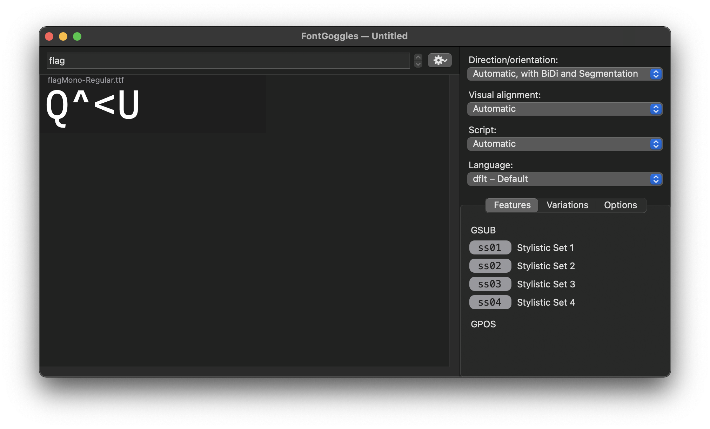

# flag Mono

When writing the assignment, � used a font called **flag Mono**. Despite looking just like a normal monospaced font, it claimed itself to be **stylish** in a various of ways. Perhaps there are something special about it, � thought.

## Writeup
Extract the font file from the XPS document. (method can be found on Wikipedia)
https://en.wikipedia.org/wiki/ODTTF

Inspect the font file, we can see that it has OpenType Stylistic Sets implemented. 
https://docs.microsoft.com/en-us/typography/opentype/spec/features_pt#ssxx

Peeking into its definitions, we can see that each Stylistic set converts the word `flag` into a part of the actual flag. Install the font, type `flag` and then enable the Stylistic Sets one by one to get the full flag.

`SEKAI{OpenTypeMagicGSUBIsTuringComplete}`

## Credit
Tool used for screenshot: [FontGoggles](https://fontgoggles.org/), Apache 2.0 License. Similar inspections can also be achieved with online tools like [FontDrop!](https://fontdrop.info/).