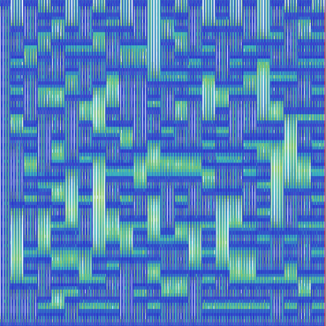
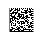

# DataMatrix Spectrogram
1. Mix left and right channels into one track
2. Open spectrogram
3. Trace the DataMatrix code found in spectrogram
3. Scan code for flag

`vsctf{<><>Stop&-&^&TalkBBABStart}`

> ♪ エンドマークに希望と涙を添えて / cosMo