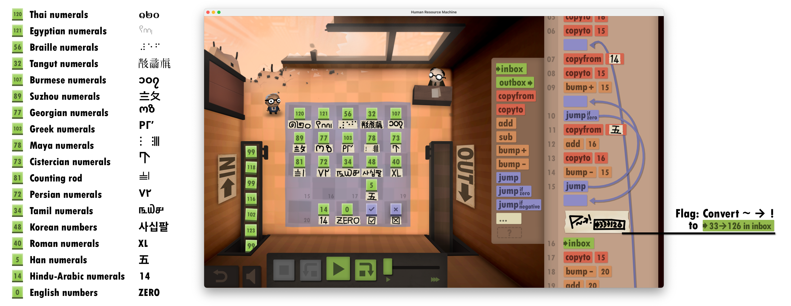

# A letter from the Human Resource Management

> Hello, worker!
> 
> It’s really great to see you again after our 42 years of hard work. I almost thought you would never come back when you left for the other 7 billion.
> 
> The employee, as usual, has sent you the instructions, and said something like...
> 
> > “You should get a big check mark if everything goes well.”
> 
> I don’t really know what that means, but it must be something promising. 
> 
> The Facilities Management has left you some notes on the floor. Consult them when in doubt. They must be very useful. I believe you can do a good job, just like the last 42 years. Good luck!
> 
> *Your presence is required on the next floor*,  
> Managment

## Writeup

All sorts of hint in the question suggests that this is a piece of source code for the Human Resource Machine Assembly language. Comments in the code shows that the input is the flag in ASCII integers. The code performs an XOR of the input and the sequence [75, 70, 65, ..., 0] and compare them with the data on the floor. If all values match, "check mark” will be sent to output, otherwise “cross” will be sent.

Values in the memory (floor) are written on the labels. 

The code implements a logic similar to the following code:

```python
floor = [...]
counter = 21
multiplier = 18
wrong = 24
correct = 23

while floor[counter]: 
    a = floor[counter] * floor[multiplier]
    b = inbox()
    if a ^ b != floor[floor[counter]]:
        outbox(floor[wrong])
        exit()
    floor[counter] -= 1
outbox(floor[correct])
```

`SEKAI{cOnGr47s}`


Below is an illustration of all labels and values on the floor. Note that this is a modified screenshot, the game itself was not modified to run this program.



## Credit

Game screenshot from Human Resource Machine by [Tomorrow Corporation](https://www.tomorrowcorporation.com/).