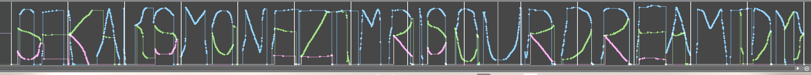

# I love this world

**D**id **y**ou k**n**ow?  
Vo**c**a**l**oid is a voic**e** synthesizer software developed by Yamaha.  
Cy**b**e**r** D**i**va and Cyber Songman are the first two first-party English-only voicebanks of Vocaloid.

Flag format (Regex): `SEKAI\{[A-Z]+\}`

## Writeup
Hint suggest looking at DYN, CLE, and BRI parameter of the VSQX file.

Overlapping the parameters, we can see the flag.

Flag: `SEKAI{SMONEZTMRISOURDREAMTDY}`

> キミを想う人の数だけ  
> キミを創る未来がある  
> キミを育むようなこの世界が  
> 僕は好きなんだ
> 
> どこかの誰かの遠い明日は  
> 今日の僕らの夢の続き
>
> — [I Love This World / にとぱん](https://www.nicovideo.jp/watch/sm23073336)